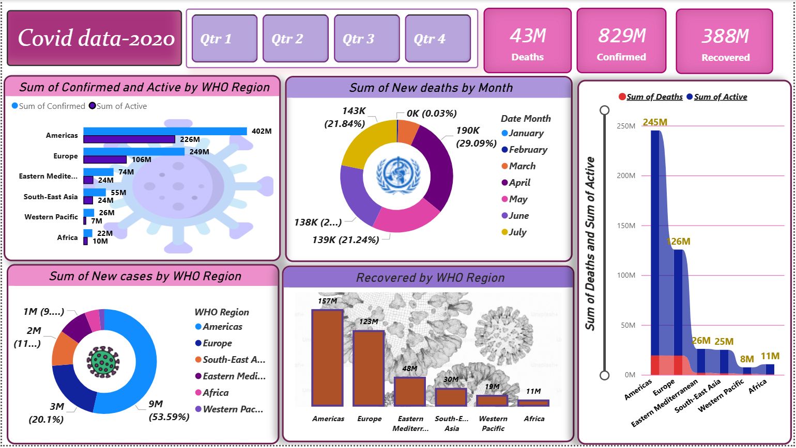

# Covid19-PowerBI-Dashboard
A Power BI dashboard visualizing global Covid-19 data (2020), with insights on cases, deaths, recoveries, and regional trend

# 🦠 Covid-19 Dashboard (2020)
---

  

## 📌 Project Overview
This project analyzes the global impact of Covid-19 in 2020, highlighting confirmed cases, deaths, recoveries, and regional trends.  
The interactive dashboard was built in **Power BI** to visualize patterns and support data-driven insights.

---

## 🎯 Objectives
- Track the spread and impact of Covid-19 across different regions.
- Identify peak months for cases and deaths.
- Compare active, recovered, and fatality rates globally.
- Highlight regions with the highest and lowest Covid-19 burden.

---

## 📂 Dataset
- **Source:** [WHO Covid-19 Dataset](https://covid19.who.int/)  
- **Period Covered:** Jan 2020 – Dec 2020  
- **Data Format:** CSV

---

## 🛠 Tools & Technologies
- **Power BI** – Dashboard creation and visualization
- **Microsoft Excel** – Data cleaning & preprocessing
- **DAX (Data Analysis Expressions)** – Calculated measures
- **Power Query** – Data transformation

---

## 🧹 Data Cleaning & Preparation
1. Removed null and duplicate records.
2. Standardized column names and data types.
3. Filtered dataset for the year 2020 only.
4. Aggregated daily data into monthly summaries.
5. Created calculated measures for:
   - Total Confirmed Cases
   - Total Deaths
   - Total Recoveries
   - Active Cases

---

## 📊 Visualizations in the Dashboard
- **KPI Cards:** Total cases, deaths, recoveries
- **Line Charts:** Monthly trend of cases and deaths
- **Bar Charts:** Confirmed cases by region
- **Donut Charts:** Recovery distribution
- **Map Visualization:** Geographical spread of Covid-19
- **Active Cases Breakdown:** By WHO region

---

## 🔍 Key Insights
- **Global Impact Summary:**
  - **Total Confirmed Cases:** 829M  
  - **Total Deaths:** 43M  
  - **Total Recoveries:** 388M  

- **Highest New Cases by Region:**
  - Americas: 9M new cases (53.59% share)  
  - Followed by Europe & South-East Asia  

- **Deaths Over Time:**
  - March: Highest deaths (~190K, 29.09%)  
  - May & July were other peak months  
- **Confirmed Cases by Region:**
  - Americas: 402M  
  - Europe: 249M  
  - South-East Asia: 74M  
- **Recovery Trends:**
  - Americas: 157M recoveries  
  - Europe: 123M recoveries  
  - Lowest in Africa & Western Pacific

---
## 👩‍💻 Author
**Amisha Nakoti**  
|Data Analyst |
